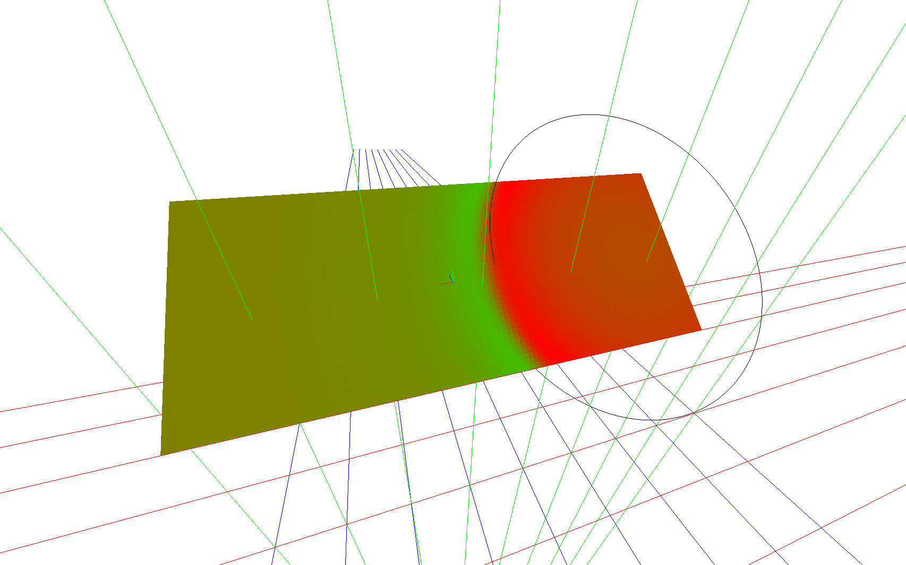
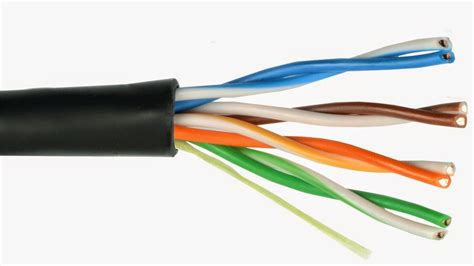
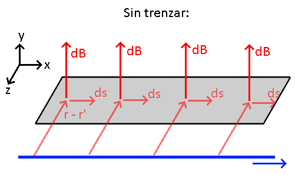
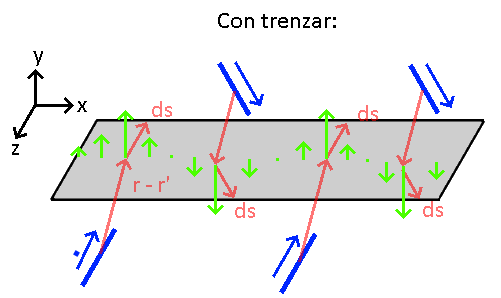
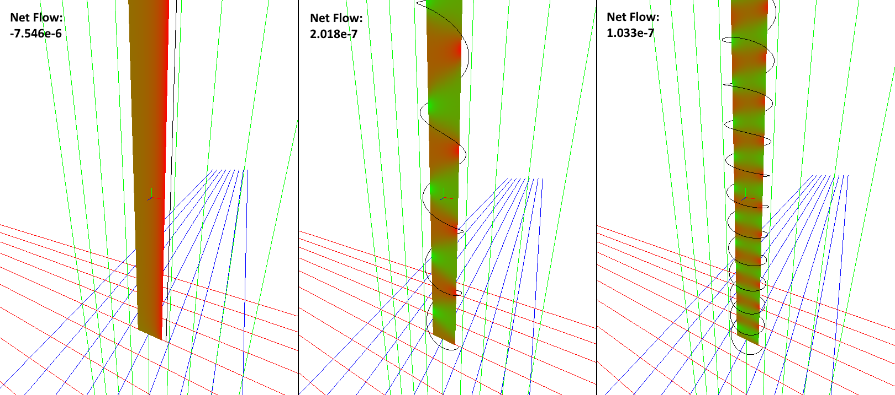
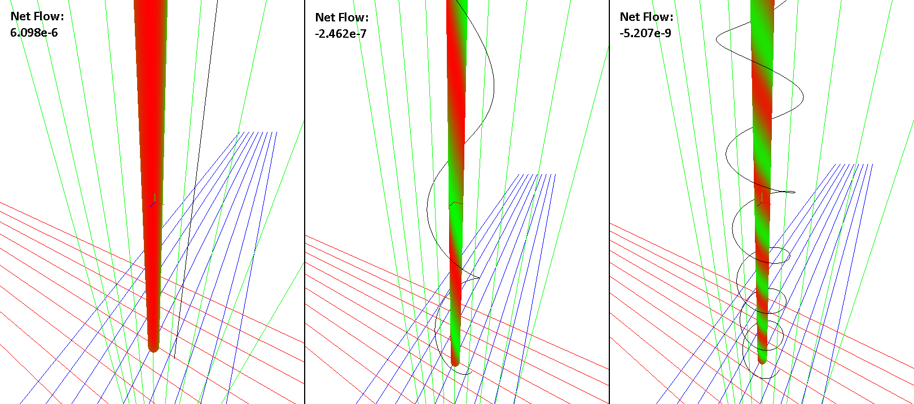
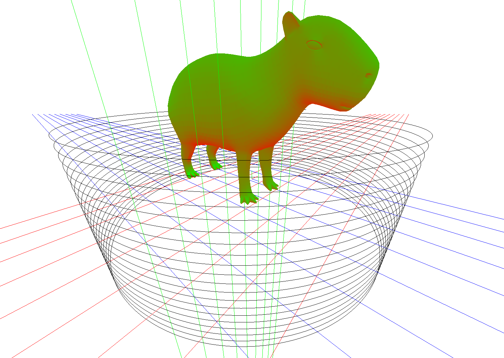
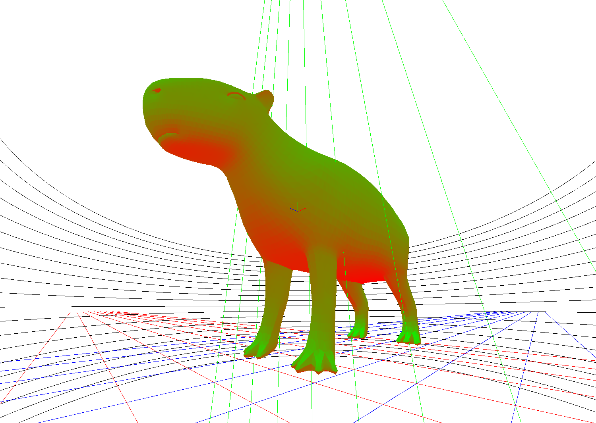

# Magneplot

Una herramienta de visualización de flujo del campo de inducción magnética generado por una curva sobre una superficie.

Funciona discretizando la superficie en parches (triángulos) y la curva en segmentos (líneas rectas), para luego aplicar la ley de Biot-Savart y el método de integración de Euler y así obtener una aproximación del flujo del campo de inducción magnética por cada parche de la superficie.

Teniendo el flujo del campo sobre cada parche de la superficie nos permite dos cosas:
- Sumando el flujo de todos los parches (que puede ser positivo o negativo), podemos obtener el flujo neto sobre toda la superficie.
- Dividiendo el flujo de cada parche por su área, podemos obtener la "intensidad" del flujo en dicho parche de la superficie.

Con esto en mente, el programa entonces se divide en dos partes:
- Un _generador_, que toma una superficie y una curva, discretiza ambas, y luego calcula el flujo sobre cada parche
- Un _visualizador_, que toma los resultados del generador y abre una ventana con gráficos 3D mostrando los resultados en un espacio 3D navegable.

## Requerimientos para correr
El proyecto fue desarrollado usando (y probado con) [Visual Studio 2022](https://visualstudio.microsoft.com/), con el workload de .NET Desktop Development para aplicaciones de consolas, pero debería también funcionar en [VS Code](https://code.visualstudio.com/) usando [extensiones para C#](https://code.visualstudio.com/Docs/languages/csharp). El programa usa el runtime .NET 8.0.

Se hace uso de las siguientes librerías:
- [TrippyGL](https://github.com/SilkCommunity/TrippyGL) - Un motor de gráficos OpenGL desarrollado por mí. Simplifica mucho la creación de gráficos 3D interactivos en tiempo real.
- [Silk.NET](https://github.com/dotnet/Silk.NET) - Una "navaja suiza" de librerías de bajo nivel que provee acceso a funcionalidades muchas veces tomadas por obvias. Usado también por TrippyGL, provee bindings a OpenGL, windowing, input (teclado, mouse, gamepad), y tipos matemáticos (matrices, vectores).

Todas las dependencias están declaradas en la solución del proyecto como referencias a paquetes NuGet, por ende se deberían descargar solas por el compilador o IDE.

El proyecto se puede correr desde adentro del IDE, o si tenés dotnet instalado podes compilar y correr el proyecto usando el comando `dotnet`:

```bash
$ git clone https://github.com/ThomasMiz/Magneplot.git
$ cd Magneplot/Magneplot
$ dotnet run
```

## Instrucciones de uso
El programa no tiene una interfaz gráfica para especificar el modelo 3D y curva a visualizar, sino que se especifica mediante un archivo json, por defecto `configs/config.json`. En este archivo se especifica el modelo 3D a usar y la curva.

La curva puede ser un espiral/solenoide, una circunferencia, o una línea recta entre dos puntos. El modelo puede ser un plano o un cilindro, o también se puede cargar un modelo 3D de tipo `.obj`.

Notar que la configuración incluye cómo discretizar la superficie y la curva. Mientras más parches tenga la superficie o segmentos tenga la curva, más tiempo se tardará en generar el resultado. De todos modos el programa almacena los resultados calculados en una carpeta `models`, y si detecta que una configuración ya fue calculada anteriormente entonces simplemente la carga del archivo. La carpeta `models` se puede borrar sin ningún problema.

Acá tenemos una configuración de ejemplo, el archivo [configs/config.json](/Magneplot/configs/config.json):

```json
{
  "model": {
    "type": "plane",
    "config": {
      "center": { "x": 1, "y": 4, "z": 0 },
      "horizontalVector": { "x": 1, "y": 0, "z": 0 },
      "verticalVector": { "x": 0, "y": 1, "z": 1 },
      "width": 5,
      "height": 2,
      "horizontalSlices": 100,
      "verticalSlices": 40
    }
  },
  "curve": {
    "type": "spiral",
    "config": {
      "center": { "x": -1, "y": 4, "z": 0 },
      "direction": { "x": 0, "y": -1, "z": 1 },
      "startTowards": { "x": 1, "y": 0, "z": 0 },
      "radius": 1.8,
      "length": 0.4,
      "step": 0.4,
      "segments": 1600
    }
  },
  "I": 1
}
```

En este archivo, especificamos de modelo un plano, cuyo centro es en (1, 4, 0), especificamos la orientación del plano con dos vectores, uno "eje horizontal" (1, 0, 0) y otro "eje vertical" (0, 1, 1) (el vector normal del plano será el producto cruzado entre estos dos vectores, en este caso (0, -1, 1)). Luego especificamos un ancho de 5 (tamaño a lo largo del "eje horizontal") y un alto de 2 (tamaño de lo largo del "eje vertical") y por último especificamos cómo discretizar el plano; en este caso pedimos 100 divisiones a lo largo del eje horizontal y 40 a lo largo del vertical, por ende este plano de 5x2 se divide en 4000 cuadrados de 0.05x0.05, y cada uno de estos cuadrados también se divide en 2 triángulos rectángulos.

Luego especificamos de curva un espiral, cuyo centro es en (-1, 4, 0), que avanza  girando hacia la dirección (0, -1, 1), con un radio de 1.8, longitud de 0.4, dando una vuelta cada 0.4 y comenzando en la dirección (1, 0, 0). Para discretizar, el espiral se divide en 1600 segmentos.

El resultado de este archivo es el siguiente:



_Notar: los vectores de dirección internamente deben estar normalizados. Sin embargo, si se especifica un vector no-normal este será normalizado. Los vectores startTowards y parecidos deben ser ortogonales al vector dirección, además de normales. Si no lo son, serán ortonormalizados usando Gram-Schmidt._

Se pueden encontrar más ejemplos de configuraciones, incluyendo del uso de rectas, cilindros y modelos `.obj`, en [la carpeta configs](Magneplot/configs).

## Motivación
Los cables Ethernet son cables UTP, o Unshielded Twisted Pair, que significa que se compone de líneas organizadas en _pares trenzados_, como se muestra en la foto:



La razón por la que se trenzan es para evitar un fenómeno que se conoce como _crosstalk_, en donde una transmisión por una línea puede interferir sobre la otra línea.

Con los contenidos de Física III en mente, podemos intentar entender por qué ocurre esto. Si aplicamos las leyes de Biot-Savart y Faraday-Lenz podemos ver como una transmisión en una línea podría afectar a otra cercana.

La idea es simple; estos cables no manejan voltajes ni corrientes muy grandes, pero si cambian muy rápido (Ethernet Cat5 son 100Mbps, 0 100MHz, y Gigabit Ethernet es 10 veces más que eso!), por ende cualquier tipo de inductancia mutua entre dos líneas podría causar que una transmisión por una genere un efecto sobre la otra.

Durante la materia siempre modelamos los cables como hilos infinitamente pequeños, pero esto obviamente no nos sirve acá ya que en ese caso los hilos no tendrían área, por ende no puede haber flujo del campo de inducción magnética! Una primera solución es reemplazar un hilo por un plano, la idea es que el efecto que tiene el campo de inducción sobre la superficie del plano sería constante sin no los trenzamos, pero si los trenzamos se cancelaría a lo largo del plano.

Acá lo intento ilustrar con dibujitos:




El objetivo original de este proyecto fue realizar esta visualización, que se encuentra a continuación en la sección de galería de imágenes.

## Galería de Imágenes
El rojo indica flujo positivo y el verde indica flujo negativo.

Acá tenemos un plano que mide 20 metros de alto y 1.2 de ancho (no se ve todo el alto del plano) al lado de un alambre. En la imágen de la izquierda el alambre no se trenza, y en las otras se trenza con un radio de 0.8m, dando una vuelta cada 3m y 1.2m. Vemos que mientras más se trenza el alambre, más baja el flujo neto sobre el plano.



Acá tenemos un cilindro con un radio de 0.3m y un alto de 40m al lado de un alambre. En la imágen de la izquierda el alambre no se trenza, mientras que en las otras dos se trenza con un radio de 1.2m dando una vuelta cada 8m y 3m. El resultado es el mismo; mientras más trenzamos el alambre más baja el flujo neto sobre el cilindro, y los colores forman este patrón de "bastón navideño".



Acá tenemos un carpincho en una bobina, porque la ciencia es para preguntarse si podés, no si deberías:





## Dudas?
Cualquier duda siéntanse libres de escribirme al email del ITBA de Thomas Mizrahi!
